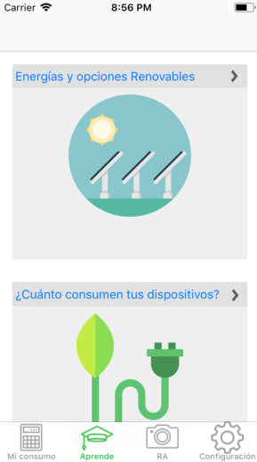
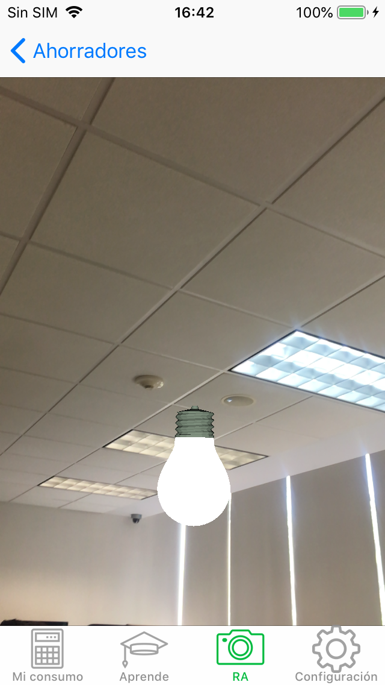

# Ecobook
A native ios application that helps users learn about and reduce their residential energy consumption. (The app does not offer an english translation).

Una aplicación nativa para ios que ayuda a los usuarios a aprender sobre su consumo energético residencial.

### Preview 

### Prerequisites - Requisitos

To try these project you need the latest version of Xcode on a Mac computer.

Es necesario tener la última versión de Xcode en una Mac para probar el código.

### Installation - Instalación

Download everything inside '__MACOSX/ProyectoEnergias', open the entire proyect folder on Xcode and run it.

Descarga todo dentro de '__MACOSX/ProyectoEnergias', abre la carpeta completa en Xcode y corre el proyecto.

## Built With - Herramientas utilizadas

* [Swift](https://swift.org/documentation/) - Programming language / lenguaje de programación

External libraries/librerías externas: 

* [WeScan](https://github.com/WeTransfer/WeScan) - Photo Scanning tool / herramienta para escáneo con fotos
* [Charts](https://github.com/danielgindi/Charts) - Charts visualization tool / Herramienta para visualizar gráficas
* [Tesseract](https://github.com/gali8/Tesseract-OCR-iOS) - OCR tool / herramienta de reconocimiento de texto

## Authors - Autores

* **Ali Villegas** - *Lead programmer* - [AliVillegas](https://github.com/AliVillegas)
* **Julián Herrera** - [JulianHerreraH](https://github.com/JulianHerreraH)

## License

This project is licensed under the MIT License - see the [LICENSE.md](LICENSE.md) file for details.

Este projecto está protegido bajo la licencia MIT- para ver más detalles revisar [LICENSE.md](LICENSE.md).
